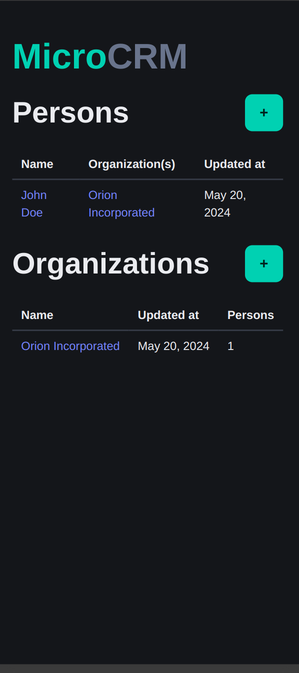
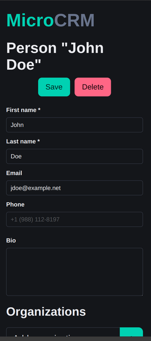

<p align="center">
   
</p>

# MicroCRM : Chaîne CI/CD (Option B)

[](https://github.com/loraine19/p9-cicd/actions/workflows/ci.yml)
[](https://github.com/loraine19/p9-cicd/actions/workflows/nightly.yml)

Industrialisation de la chaîne d'intégration et de déploiement continus de
**MicroCRM**, l'application interne d'Orion : un CRM simplifié bâti sur
**Spring Boot 3** (API) et **Angular 17** (client).

Ce dépôt contient les workflows GitHub Actions, les Dockerfiles, l'orchestration
Docker Compose et la configuration d'analyse SonarQube Cloud. La documentation
technique détaillée est livrée séparément (PDF).

---

## Sommaire

- [Architecture du dépôt](#architecture-du-dépôt)
- [Démarrage rapide](#démarrage-rapide)
- [Développement local](#développement-local)
- [Tests](#tests)
- [La chaîne CI/CD](#la-chaîne-cicd)
- [Conteneurisation](#conteneurisation)
- [Publier une version](#publier-une-version)
- [Configuration requise du dépôt](#configuration-requise-du-dépôt)
- [Choix techniques](#choix-techniques)
- [Pistes d'amélioration](#pistes-damélioration)

---

## Architecture du dépôt

```
.
├── .github/
│   ├── workflows/
│   │   ├── ci.yml          Build, tests, Sonar, images + smoke test (push / PR)
│   │   ├── release.yml     semantic-release + images GHCR           (après CI verte)
│   │   └── nightly.yml     Tests + stack docker compose             (planifié)
│   └── dependabot.yml      Mises à jour automatisées des dépendances
├── back/                   API Spring Boot 3.2.5 : Java 17, Gradle 8.7
├── front/                  Client Angular 17 : npm, Karma/Jasmine
├── misc/docker/            Configuration Caddy du conteneur front
├── Dockerfile              Build multi-stage (cibles `front` et `back`)
├── docker-compose.yml      Orchestration locale
└── sonar-project.properties
```

Le back-end utilise Gradle (pas Maven) : le dépôt fourni embarque déjà un
wrapper Gradle 8.7, donc la CI/CD s'est alignée dessus au lieu de migrer.

---

## Démarrage rapide

Prérequis : **Docker** et **Docker Compose v2**.

```bash
docker compose up --build
```

| Service   | URL                   |
| --------- | --------------------- |
| Front-end | http://localhost:8082 |
| API       | http://localhost:8080 |

Le front n'est démarré qu'une fois l'API déclarée saine (`healthcheck`).
Pour arrêter : `docker compose down`.

### Utiliser les images publiées

Chaque release publie les images sur GHCR, taguées avec la version et `latest` :

```bash
docker pull ghcr.io/loraine19/p9-cicd-back:latest
docker pull ghcr.io/loraine19/p9-cicd-front:latest
```

---

## Développement local

Prérequis : **JDK 17** (voir avertissement ci-dessous), **Node.js 22**, **npm ≥ 10**.

Attention, il faut un JDK 17 ou 21, pas plus récent : le wrapper Gradle 8.7 ne
gère pas Java 22+. Avec Java 25 par exemple, le build plante avec
`Unsupported class file major version`. Si `java -version` n'affiche ni 17 ni 21,
installez un JDK 17 :

```bash
# Debian / Ubuntu / ChromeOS (Crostini)
sudo apt update && sudo apt install -y openjdk-17-jdk
export JAVA_HOME=/usr/lib/jvm/java-17-openjdk-amd64   # adaptez via `ls /usr/lib/jvm/`
```

<details>
<summary><strong>Back-end</strong></summary>

```bash
cd back
chmod +x gradlew           # une seule fois : le wrapper doit être exécutable
./gradlew bootRun          # démarre l'API sur http://localhost:8080
./gradlew bootJar          # produit build/libs/microcrm-0.0.1-SNAPSHOT.jar
```

</details>

<details>
<summary><strong>Front-end</strong></summary>

```bash
cd front
npm ci                     # installation déterministe depuis le lockfile
npm start                  # serveur de développement sur http://localhost:4200
npm run build              # bundle de production dans dist/microcrm/browser
```

</details>

---

## Tests

| Commande                     | Où elle est définie               | Ce qu'elle fait                         | Quand elle s'exécute  |
| ---------------------------- | --------------------------------- | --------------------------------------- | --------------------- |
| `./gradlew build`            | `back/build.gradle`               | Compile et lance les tests JUnit 5      | CI (push/PR), nightly |
| `./gradlew jacocoTestReport` | `back/build.gradle`               | Produit le XML de couverture pour Sonar | CI                    |
| `npm test`                   | `front/package.json` → `ng test`  | Lance les specs Jasmine dans Karma      | CI (push/PR), nightly |
| `npm run build`              | `front/package.json` → `ng build` | Bundle de production                    | CI, release           |

La release ne rejoue pas les tests : ils sont exécutés par `ci.yml`.

En local :

```bash
# Back-end (JDK 17 requis, cf. section précédente)
cd back && ./gradlew test
```

```bash
# Front-end : un navigateur Chrome/Chromium doit être installé.
# `ng test` seul tente de lancer Chrome en fenêtré et échoue en headless :
# utilisez toujours le launcher ChromeHeadlessNoSandbox.
sudo apt install -y chromium            # si aucun Chrome n'est installé
export CHROME_BIN=$(which chromium)
cd front && npm test -- --watch=false --browsers=ChromeHeadlessNoSandbox
```

> Erreur `No binary for Chrome browser on your platform` → la variable
> `CHROME_BIN` n'est pas définie ou aucun navigateur n'est installé.

En CI, ces prérequis sont déjà satisfaits : le runner `ubuntu-latest` embarque
Chromium et le JDK est fixé à 17. Le launcher `ChromeHeadlessNoSandbox` est
défini dans `karma.conf.js`.

```bash
npm test -- --watch=false --browsers=ChromeHeadlessNoSandbox --code-coverage
```

### Vulnérabilités npm

`npm audit` remonte beaucoup de vulnérabilités, mais la grande majorité vient de
l'outillage de build (webpack, karma…), qui n'est jamais déployé. Pour voir ce
qui touche vraiment la production : `npm audit --omit=dev`. Le reste concerne
Angular 17.

Ne pas lancer `npm audit fix --force` : ça casse Angular. La montée de version
d'Angular est hors périmètre de la mission, Dependabot et SonarCloud la suivent
(cf. plan de sécurité, documentation §5).

---

## La chaîne CI/CD

### `ci.yml` : intégration continue

Déclenché sur `push` (`main`, `develop`), sur `pull_request` et manuellement.

```
        ┌──────────┐   ┌──────────┐
        │   back   │   │  front   │      builds + tests en parallèle
        └────┬─────┘   └────┬─────┘
             └───────┬──────┘
              ┌──────┴───────┐
        ┌─────┴─────┐  ┌─────┴──────┐
        │   sonar   │  │   docker   │   analyse qualité / build + smoke test
        └───────────┘  └────────────┘
```

`back` et `front` sont indépendants et tournent en parallèle, ce qui raccourcit
l'attente. `sonar` et `docker` attendent leurs artefacts.

Le job `docker` ne fait pas que construire les images : il les démarre et vérifie que l'API répond sur `/persons` et que le front sert bien l'application.

### `nightly.yml` : testing périodique

Planifié tous les jours à 03h00 UTC, et lançable manuellement
(`workflow_dispatch`). Elle rejoue les tests back et front, construit les deux
images et démarre la stack complète via `docker compose` (attente des
healthchecks, puis appel de l'API et du front).
Le but est d'attraper les régressions venant de l'environnement (images de base,
runners, registres) plutôt que d'un changement de code.

### `release.yml` : déploiement continu

Déclenché quand `ci.yml` se termine sur `main` (`workflow_run`), et seulement
si la CI est verte : aucune version n'est publiée si un test échoue.
semantic-release lit ensuite les messages de commit (Conventional Commits) et
décide s'il faut publier une version :

| Type de commit                 | Effet                 |
| ------------------------------ | --------------------- |
| `fix:`                         | PATCH (1.0.0 → 1.0.1) |
| `feat:`                        | MINOR (1.0.0 → 1.1.0) |
| `feat!:` ou `BREAKING CHANGE:` | MAJOR (1.0.0 → 2.0.0) |
| `ci:`, `chore:`, `docs:`…      | aucune version        |

La release construit les artefacts (sans rejouer les tests, déjà exécutés par
`ci.yml`), puis publie les images sur GHCR si une version est créée.

### `dependabot.yml` : mises à jour des dépendances

Vérification hebdomadaire de Gradle (`/back`), npm (`/front`), des actions
GitHub et des images Docker. Les mises à jour mineures et correctifs sont
regroupés en une seule pull request par écosystème, validée par `ci.yml` avant
fusion. Les montées de version majeures (Spring Boot, Gradle, Angular, images
Java/Node) sont exclues partout : elles se font à la main. Le job Sonar est
ignoré sur les PR Dependabot, car GitHub ne leur transmet pas les secrets.

---

## Conteneurisation

`Dockerfile` est un build multi-stage à deux cibles :

| Cible   | Image de base                   | Contenu                        | Port |
| ------- | ------------------------------- | ------------------------------ | ---- |
| `front` | `caddy:2-alpine`                | Bundle Angular servi par Caddy | 80   |
| `back`  | `eclipse-temurin:17-jre-alpine` | JAR Spring Boot                | 8080 |

```bash
docker build --target back  -t microcrm-back:local  .
docker build --target front -t microcrm-front:local .
```

Quelques règles suivies : images officielles, minimales et versionnées (pas de
`latest` en base) ; build et runtime séparés, donc ni JDK ni `node_modules` dans
l'image finale ; utilisateur non privilégié pour le back-end ; un processus par
conteneur, Compose s'occupe de l'orchestration. Les healthchecks servent à
`depends_on: condition: service_healthy` et à `docker compose up --wait` dans la
nightly.

---

## Publier une version

Le versionnement suit SemVer (`MAJOR.MINOR.PATCH`). On ne pose aucun tag à la
main : tout se joue dans le message de commit.

```bash
git commit -m "feat: add organization search"   # → version MINOR
git push origin main
```

Le push lance la CI. Si elle est verte, la release démarre.

Si une version est créée, le workflow produit :

- le tag `vX.Y.Z` et la release GitHub contenant le JAR, le bundle Angular
  zippé et les sommes SHA-256 ;
- le fichier `CHANGELOG.md`, mis à jour par un commit `chore(release)` ;
- les images `ghcr.io/loraine19/p9-cicd-back` et `-front`, taguées `X.Y.Z` et `latest`.

---

## Configuration requise du dépôt

Avant la première exécution complète de la CI :

1. **SonarQube Cloud** : créer le projet sur [sonarcloud.io](https://sonarcloud.io).
   `sonar.projectKey` et `sonar.organization` sont déjà renseignés dans
   `sonar-project.properties` ; ils doivent correspondre au projet créé.
2. **Secret `SONAR_TOKEN`** : _Settings → Secrets and variables → Actions →
   New repository secret_. Aucun secret n'est stocké dans le dépôt : les
   workflows les lisent exclusivement via `${{ secrets.* }}`.
3. **GHCR** : aucune configuration, les workflows s'authentifient avec le
   `GITHUB_TOKEN` éphémère du job.
4. **Permissions** : dans _Settings → Actions → General_, autoriser la lecture et
   l'écriture pour le workflow de release.
5. **Dependabot** : activé automatiquement par la présence de
   `.github/dependabot.yml`.

---

## Choix techniques

| Décision                          | Justification                                                                                       |
| --------------------------------- | --------------------------------------------------------------------------------------------------- |
| **GitHub Actions**                | Natif au dépôt, aucun serveur à maintenir, secrets et registre intégrés.                            |
| **Gradle conservé**               | Le projet embarque un wrapper Gradle 8.7 ; migrer vers Maven aurait ajouté un risque sans bénéfice. |
| **Jobs parallèles**               | Le retour d'erreur au développeur est donné par le composant le plus rapide.                        |
| **`npm ci` / wrapper Gradle**     | Builds reproductibles : versions figées par le lockfile et le wrapper.                              |
| **GHCR plutôt que Docker Hub**    | Authentification par `GITHUB_TOKEN`, pas de compte ni de secret externe à gérer.                    |
| **semantic-release**              | Version calculée depuis les commits : pas de tag manuel, changelog et release générés.              |
| **Tests dans `ci.yml` seulement** | Les tests ne sont exécutés qu'une fois ; la release ne fait que construire et publier.              |
| **Release après CI verte**        | `workflow_run` : règle de semantic-release, publier seulement après la réussite de tous les tests.  |
| **Nightly**                       | Détecte les régressions d'environnement sans attendre un commit.                                    |
| **Dependabot**                    | Les montées de version arrivent en PR et sont validées par la CI avant fusion.                      |

---

## Pistes d'amélioration

- **Scan des images (Trivy)** : équivalent libre de Twistlock, à ajouter à la
  nightly pour détecter les CVE des images et des dépendances. Non mis en place
  à ce jour ; SonarCloud couvre l'analyse du code.
- **Protection de la branche `main`** : fusion uniquement par pull request,
  avec la CI verte obligatoire.

---

## Captures d'écran



